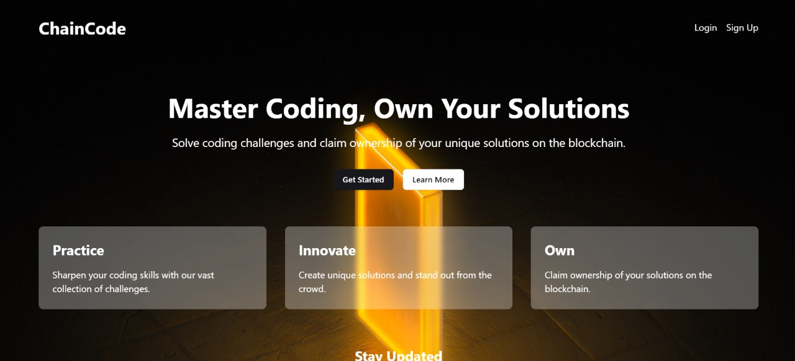
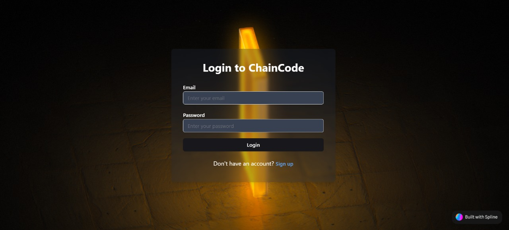
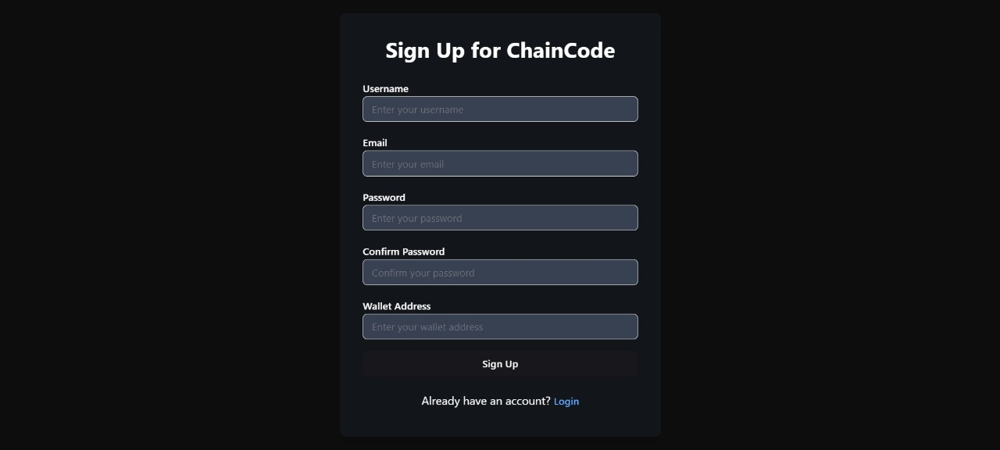
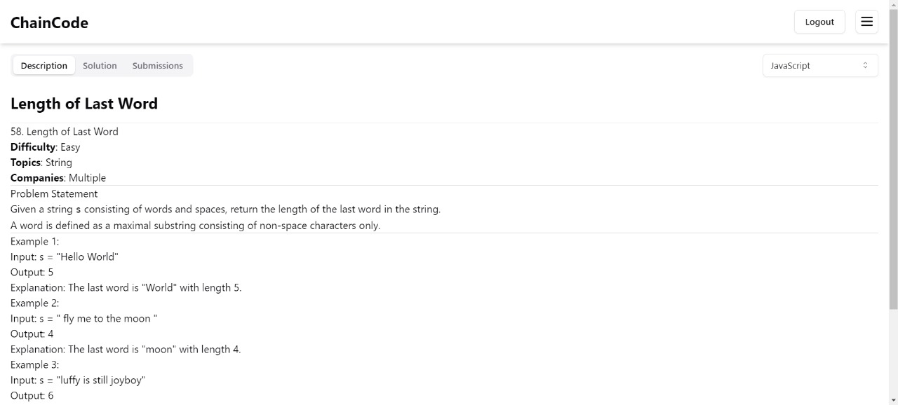
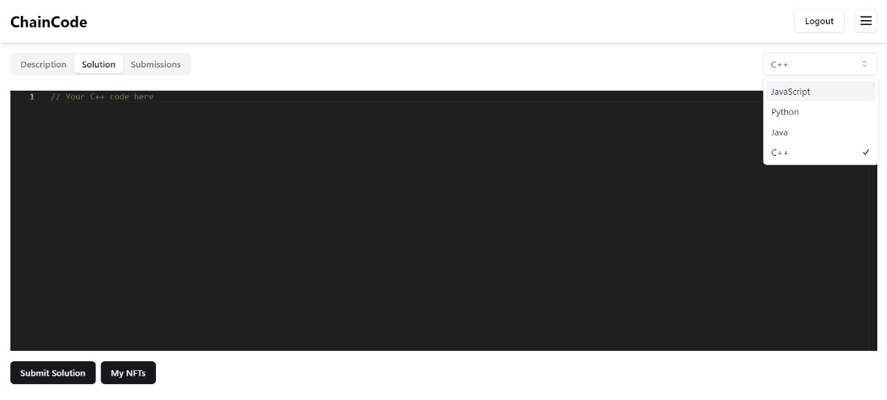

# ChainCode: Blockchain-Supported Coding Accumulator Platform

## Table of Contents
- [Overview](#overview)
- [Key Features](#key-features)
- [Technologies Used](#technologies-used)
- [System Architecture](#system-architecture)
- [Getting Started](#getting-started)
  - [Prerequisites](#prerequisites)
  - [Installation](#installation)
  - [Configuration](#configuration)
- [Usage](#usage)
- [API Documentation](#api-documentation)
- [Testing](#testing)
- [Deployment](#deployment)
- [Contributing](#contributing)
- [Roadmap](#roadmap)
- [License](#license)
- [Acknowledgements](#acknowledgements)
- [Contact](#contact)

## Overview

ChainCode is an innovative web application that revolutionizes the way developers enhance their coding skills and share solutions. By leveraging blockchain technology, ChainCode provides a secure, transparent, and incentivized platform for coding practice and collaboration.

Our platform addresses the challenge of fragmented coding resources by offering a centralized hub where developers can:
- Tackle a diverse range of coding problems
- Submit solutions in multiple programming languages
- Have their code automatically evaluated and verified on the blockchain
- Earn unique NFTs for their verified solutions
- Track their progress and performance over time

ChainCode not only helps developers improve their skills but also creates a trustworthy ecosystem for sharing and validating coding solutions, backed by the immutability and transparency of blockchain technology.

## Key Features

1. User Authentication System: Secure login and registration process with JWT-based authentication.
2. Comprehensive Problem Repository: A wide range of coding challenges across different difficulty levels and topics.
3. Multi-Language Solution Submission: Support for submitting solutions in various programming languages.
4. Automated Code Evaluation: Instant feedback on code correctness and efficiency.
5. Blockchain-Based Solution Verification: Utilizes the Holesky testnet to verify and store solution hashes.
6. NFT Minting for Verified Solutions: Earn unique digital assets for successfully solving problems.
7. User Performance Analytics: Detailed insights into coding progress and areas for improvement.
8. Leaderboards and Achievements: Gamification elements to encourage continued learning and engagement.
9. Community Forums: Discuss problems, share insights, and collaborate with other developers.

## Technologies Used

- Frontend:
  - React 18: For building a dynamic and responsive user interface
  - TypeScript 5: For type-safe code and improved developer experience
  - Vite 4: As a fast build tool and development server
  - shadcn/ui: For consistent and customizable UI components
  - spline: For creating interactive 3D elements in the UI

- Backend:
  - Express.js 4: As the web application framework
  - MongoDB 5 with Mongoose 7: For flexible and scalable data storage
  - JSON Web Tokens (JWT): For secure user authentication

- Blockchain Integration:
  - Holesky testnet: Ethereum test network for deploying and testing smart contracts
  - Hardhat: Development environment for compiling, deploying, testing, and debugging Ethereum software
  - Alchemy API: For interacting with the Ethereum blockchain

- Testing:
  - Jest: For unit and integration testing
  - React Testing Library: For component testing

- Other Tools:
  - ESLint & Prettier: For code linting and formatting
  - GitHub Actions: For CI/CD pipelines

## System Architecture

ChainCode/
├── backend/
│ ├── controllers/
│ │ ├── authController.js
│ │ ├── problemController.js
│ │ └── solutionController.js
│ ├── models/
│ │ ├── User.js
│ │ ├── Problem.js
│ │ └── Solution.js
│ ├── routes/
│ │ ├── auth.js
│ │ ├── problems.js
│ │ └── solutions.js
│ ├── middleware/
│ │ └── auth.js
│ ├── utils/
│ │ ├── blockchain.js
│ │ └── codeEvaluation.js
│ └── server.js
├── src/
│ ├── components/
│ │ ├── common/
│ │ └── pages/
│ │ ├── Home.tsx
│ │ ├── ProblemList.tsx
│ │ ├── ProblemDetail.tsx
│ │ └── UserProfile.tsx
│ ├── context/
│ │ └── AuthContext.tsx
│ ├── hooks/
│ ├── services/
│ │ └── api.ts
│ ├── styles/
│ ├── App.tsx
│ └── main.tsx
├── public/
├── contracts/
│ └── SolutionVerifier.sol
├── test/
├── index.html
├── package.json
├── tsconfig.json
└── vite.config.ts

Our architecture follows a clear separation of concerns:
- The backend directory contains all server-side logic, including API routes, database models, and blockchain integration.
- The src directory houses the React frontend application, organized into components, contexts, and services.
- Smart contracts are stored in the contracts directory, separate from the web application code.
- Testing files are kept in the test directory at the root level.

## Getting Started

### Prerequisites

- Node.js (v14.0.0 or later)
- npm (v6.0.0 or later)
- MongoDB (v5.0 or later)
- MetaMask or another Ethereum wallet for interacting with blockchain features

### Installation

1. Clone the repository:
   bash
   git clone https://github.com/ShivamBajpai04/ChainCode
   cd ChainCode
   

2. Install dependencies:
   bash
   npm install
   cd backend && npm install
   

### Configuration

1. Create a .env file in the backend directory with the following parameters:
   
   MONGO_URI=your_mongodb_connection_string
   JWT_SECRET=your_secure_jwt_secret
   PORT=5000
   ALCHEMY_API_KEY=your_alchemy_api_key
   WALLET_PRIVATE_KEY=your_wallet_private_key
   

   Note: Never commit your .env file to version control. Add it to your .gitignore file.

2. Initialize the database:
   bash
   npm run db:init
   

3. Deploy the smart contract to Holesky testnet:
   bash
   npx hardhat run scripts/deploy.js --network holesky
   

## Usage

1. Start the development server:
   bash
   npm run dev
   

2. Access the application at http://localhost:3000

3. For backend development, run:
   bash
   cd backend && npm run dev
   

4. To interact with blockchain features:
   - Ensure you have MetaMask installed and connected to the Holesky testnet
   - Have some test ETH in your wallet (you can get this from a Holesky faucet)

5. Explore coding problems, submit solutions, and earn NFTs for verified solutions!

## API Documentation

Our API provides the following main endpoints:

- /api/auth: User authentication (login, register, logout)
- /api/problems: CRUD operations for coding problems
- /api/solutions: Submit and retrieve coding solutions

For detailed API documentation, please refer to our [API Documentation](API_DOCS.md) file.

## Testing

We use Jest for unit and integration testing. To run the test suite:

bash
npm run test

For frontend component testing, we use React Testing Library. Run component tests with:

bash
npm run test:components

## Deployment

1. Build the frontend:
   bash
   npm run build
   

2. Deploy the backend to your chosen hosting platform (e.g., Heroku, DigitalOcean)

3. Set up environment variables on your hosting platform

4. Ensure your MongoDB instance is accessible from your hosting environment

5. Deploy smart contracts to the Ethereum mainnet (if moving beyond testnet)

## Contributing

We welcome contributions to ChainCode! Please see our [Contributing Guidelines](CONTRIBUTING.md) for more information on how to get started.

## Roadmap

- Q3 2024: Implement advanced code analysis features
- Q4 2024: Introduce collaborative coding challenges
- Q1 2025: Launch mobile app for on-the-go coding practice
- Q2 2025: Integrate with major coding bootcamps and educational platforms

## License

This project is licensed under the [MIT License](LICENSE).

## Acknowledgements

- OpenZeppelin for smart contract libraries
- Ethereum Foundation for blockchain infrastructure
- All open-source contributors and maintainers of our dependencies

## Contact

For any inquiries, please reach out to sho9213garg@gmail.com.

---

© 2024 ChainCode. All rights reserved.
